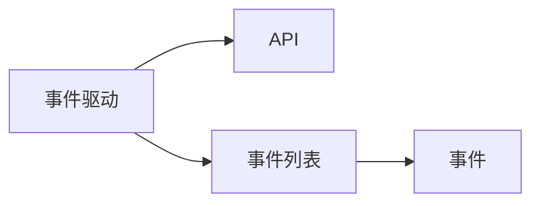

# BOT姬



```typescript
import { Api } from "../api";
import { event as e } from "../struct";

export async function onLoad() {
	console.log("plugin", "加载成功");
}
export async function onEvent(msg: e.Msg, api: Api) {}
```